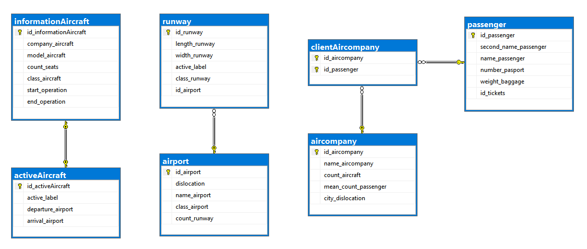
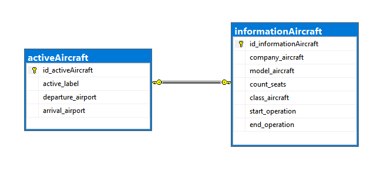
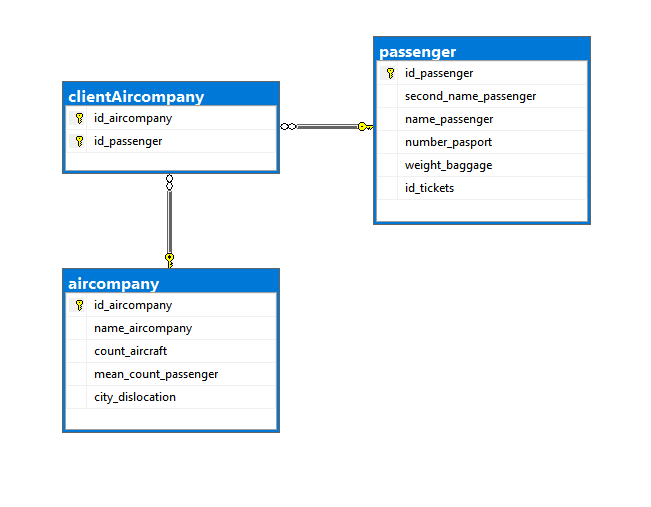

# Корпоративные базы данных

Данный репозиторий содержит решение лабораторной работы #1 по курсу "Корпоративные базы данных".

# Содержание

[Скрипты для работы с базой данных](https://github.com/Black-Viking-63/EnterpriseDataBase/tree/main/scripts)  
[Программа генерации данных для базы данных](https://github.com/Black-Viking-63/EnterpriseDataBase/tree/main/programm/ConsoleApp2)

# Описание ER-Модели
В качестве бизнес-модели была выбрана модель авиационных перевозок. Схема модели представлена на фото.    

# Описание сущностей ER-Модели
## Действующий самолет
<table>
    <thead>
        <tr>
            <th colspan =4>Active Aircraft</th>
        </tr>
    </thead>
    <tbody>
        <tr>
            <td>ScreenShot</td>
            <td>Название поля</td>
            <td>Тип данных</td>
            <td>Описание</td>
        </tr>
        <tr>
            <td rowspan=5>ScreenShot</td>
            <td>id_activeAircraft</td>
            <td>Type</td>
            <td>Row 0/2</td>
        </tr>
        <tr>
            <td>active_label</td>
            <td>Type</td>
            <td>Row 1/2</td>
        </tr>
        <tr>
            <td>departure_airport</td>
            <td>Type</td>
            <td>Row 2/2</td>
        </tr>
        <tr>
            <td>arrival_airport</td>
            <td>Type</td>
            <td>Row 3/2</td>
        </tr>       
    </tbody>
</table>

## Информация о самолете
<table>
    <thead>
        <tr>
            <th colspan =4>Infromation Aircraft</th>            
        </tr>
    </thead>
    <tbody>
        <tr>
            <td>ScreenShot</td>
            <td>Название поля</td>
            <td>Тип даных</td>
            <td>Описание</td>
        </tr>
        <tr>
            <td rowspan=7>ScreenShot</td>
            <td>id_informationAircraft</td>
            <td>Type</td>
            <td>Row 0/2</td>
        </tr>
        <tr>
            <td>company_aircraft</td>
            <td>Type</td>
            <td>Row 1/2</td>
        </tr>
        <tr>
            <td>model_aircraft</td>
            <td>Type</td>
            <td>Row 2/2</td>
        </tr>
        <tr>
            <td>count_seats</td>
            <td>Type</td>
            <td>Row 3/2</td>
        </tr>      
        <tr>
            <td>class_aircraft</td>
            <td>Type</td>
            <td>Row 4/2</td>
        </tr> 
        <tr>
            <td>start_operation</td>
            <td>Type</td>
            <td>Row 5/2</td>
        </tr> 
        <tr>
            <td>end_operation</td>
            <td>Type</td>
            <td>Row 6/2</td>
        </tr> 
    </tbody>
</table>  

## Аэропорт
<table>
    <thead>
        <tr>
            <th colspan =4>Airport</th>            
        </tr>
    </thead>
    <tbody>
        <tr>
            <td>ScreenShot</td>
            <td>Название поля</td>
            <td>Тип даных</td>
            <td>Описание</td>
        </tr>
        <tr>
            <td rowspan=5>ScreenShot</td>
            <td>id_airport</td>
            <td>Type</td>
            <td>Row 0/2</td>
        </tr>
        <tr>
            <td>dislocation</td>
            <td>Type</td>
            <td>Row 1/2</td>
        </tr>
        <tr>
            <td>name_airport</td>
            <td>Type</td>
            <td>Row 2/2</td>
        </tr>
        <tr>
            <td>class_airport</td>
            <td>Type</td>
            <td>Row 3/2</td>
        </tr>      
        <tr>
            <td>count_runway</td>
            <td>Type</td>
            <td>Row 4/2</td>
        </tr> 
    </tbody>
</table>  

## Взлетная полоса

<table>
    <thead>
        <tr>
            <th colspan =4>Runway</th>            
        </tr>
    </thead>
    <tbody>
        <tr>
            <td>ScreenShot</td>
            <td>Название поля</td>
            <td>Тип даных</td>
            <td>Описание</td>
        </tr>
        <tr>
            <td rowspan=6>ScreenShot</td>
            <td>id_runway</td>
            <td>Type</td>
            <td>Row 0/2</td>
        </tr>
        <tr>
            <td>lenght_runway</td>
            <td>Type</td>
            <td>Row 1/2</td>
        </tr>
        <tr>
            <td>width_runway</td>
            <td>Type</td>
            <td>Row 2/2</td>
        </tr>
        <tr>
            <td>active_label</td>
            <td>Type</td>
            <td>Row 3/2</td>
        </tr>      
        <tr>
            <td>class_runway</td>
            <td>Type</td>
            <td>Row 4/2</td>
        </tr> 
        <tr>
            <td>id_airport</td>
            <td>Type</td>
            <td>Row 5/2</td>
        </tr> 
    </tbody>
</table>  

## Авиакомпания

<table>
    <thead>
        <tr>
            <th colspan =4>Aircompany</th>            
        </tr>
    </thead>
    <tbody>
        <tr>
            <td>ScreenShot</td>
            <td>Название поля</td>
            <td>Тип даных</td>
            <td>Описание</td>
        </tr>
        <tr>
            <td rowspan=5>ScreenShot</td>
            <td>id_aircompany</td>
            <td>Type</td>
            <td>Row 0/2</td>
        </tr>
        <tr>
            <td>name_aircompany</td>
            <td>Type</td>
            <td>Row 1/2</td>
        </tr>
        <tr>
            <td>count_aircrfat</td>
            <td>Type</td>
            <td>Row 2/2</td>
        </tr>
        <tr>
            <td>mean_count_passenger</td>
            <td>Type</td>
            <td>Row 3/2</td>
        </tr>      
        <tr>
            <td>city_dislocation</td>
            <td>Type</td>
            <td>Row 4/2</td>
        </tr> 
    </tbody>
</table>  

## Passenger

<table>
    <thead>
        <tr>
            <th colspan =4>Passenger</th>            
        </tr>
    </thead>
    <tbody>
        <tr>
            <td>ScreenShot</td>
            <td>Название поля</td>
            <td>Тип даных</td>
            <td>Описание</td>
        </tr>
        <tr>
            <td rowspan=6>ScreenShot</td>
            <td>id_passenger</td>
            <td>Type</td>
            <td>Row 0/2</td>
        </tr>
        <tr>
            <td>second_name_passenger</td>
            <td>Type</td>
            <td>Row 1/2</td>
        </tr>
        <tr>
            <td>name_passenger</td>
            <td>Type</td>
            <td>Row 2/2</td>
        </tr>
        <tr>
            <td>number_passport</td>
            <td>Type</td>
            <td>Row 3/2</td>
        </tr>      
        <tr>
            <td>weight_baggage</td>
            <td>Type</td>
            <td>Row 4/2</td>
        </tr> 
                <tr>
            <td>id_tickets</td>
            <td>Type</td>
            <td>Row 5/2</td>
        </tr> 
    </tbody>
</table>  

# Связи сущностей

| Тип связи | Скриншот | Описание |
|:---:|:---:|:---:|
| 1-1 |  | Данным типом связи, связаны 2 сущности: "действующий" самолет и информация об этом самолете, поскольку не может быть 2-х абсолютно одинаковых самолетов. |
| 1-N |  | Данным типом связи, связаны 2 сущности: аэропорт и взлетные полосы поскольку аэропорт может иметь как одну так и несколько взлетных полос. | 
| N-M |  | Данным типом связи, связаны 2 сущности, через промежуточную третью: авиакомпания и пассажир связаны через клиентов авиакомпаний.  Поскольку, пассажир может быть зарегистрирован не в одной авиакомпании, а авиакомпании явно имеют более одного клиента(пассажира). |
