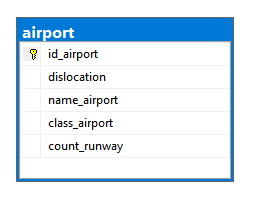
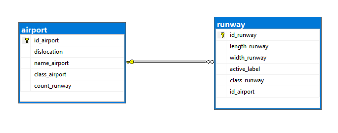

# Корпоративные базы данных

Данный репозиторий содержит решение лабораторной работы #1 по курсу "Корпоративные базы данных".

# Содержание

[Скрипты для работы с базой данных](https://github.com/Black-Viking-63/EnterpriseDataBase/tree/main/scripts)  
[Программа генерации данных для базы данных](https://github.com/Black-Viking-63/EnterpriseDataBase/tree/main/programm/ConsoleApp2)

# Описание ER-Модели
В качестве бизнес-модели была выбрана модель авиационных перевозок. Схема модели представлена на фото.    

# Описание сущностей ER-Модели
## Действующий самолет
<table>
    <thead>
        <tr>
            <th colspan =4>Active Aircraft</th>
        </tr>
    </thead>
    <tbody>
        <tr>
            <td align="center" valign="center">ScreenShot</td>
            <td align="center" valign="center">Название поля</td>
            <td align="center" valign="center">Тип данных</td>
            <td align="center" valign="center">Описание</td>
        </tr>
        <tr>
            <td rowspan=5>  </td>
            <td align="center" valign="center">id_activeAircraft</td>
            <td align="center" valign="center">int</td>
            <td align="center" valign="center">Является уникальным идентификатором, который используется для однозначной маркировки записей в таблице.</td>
        </tr>
        <tr>
            <td align="center" valign="center">active_label</td>
            <td align="center" valign="center">bool</td>
            <td align="center" valign="center">Является маркером действительности самолета.  Если выбрано значение true, то самолет действителен может летать, вследствии чего должен иметь место вылета и место прилета. Если выбрано значение false самолет считается не действительным и летать не может, а в места вылета и прилета имеют значения NULL.</td>
        </tr>
        <tr>
            <td align="center" valign="center">departure_airport</td>
            <td align="center" valign="center">VARCHAR() String</td>
            <td align="center" valign="center">Является полем, содержащим информацию о месте вылета (город) самолета, в случае если он действителен.</td>
        </tr>
        <tr>
            <td align="center" valign="center">arrival_airport</td>
            <td align="center" valign="center">VARCHAR() String</td>
            <td align="center" valign="center">Является полем, содержащим информацию о месте прилета (город) самолета, в случае если он действителен.</td>
        </tr>       
    </tbody>
</table>

## Информация о самолете
<table>
    <thead>
        <tr>
            <th colspan =4>Infromation Aircraft</th>            
        </tr>
    </thead>
    <tbody>
        <tr>
            <td align="center" valign="center">ScreenShot</td>
            <td align="center" valign="center">Название поля</td>
            <td align="center" valign="center">Тип даных</td>
            <td align="center" valign="center">Описание</td>
        </tr>
        <tr>
            <td rowspan=7> </td>
            <td align="center" valign="center">id_informationAircraft</td>
            <td align="center" valign="center">int</td>
            <td align="center" valign="center">Является уникальным идентификатором, который используется для однозначной маркировки записей в таблице.</td>
        </tr>
        <tr>
            <td align="center" valign="center">company_aircraft</td>
            <td align="center" valign="center">VARCHAR() String</td>
            <td align="center" valign="center">Является полем, сожержащим информацию о производителе самолета.</td>
        </tr>
        <tr>
            <td align="center" valign="center">model_aircraft</td>
            <td align="center" valign="center">VARCHAR() String</td>
            <td align="center" valign="center">Является полем, содержащим информацию о модели самолета.</td>
        </tr>
        <tr>
            <td align="center" valign="center">count_seats</td>
            <td align="center" valign="center">int</td>
            <td align="center" valign="center">Является полем, содержащим информацию о количестве меств в самолете.</td>
        </tr>      
        <tr>
            <td align="center" valign="center">class_aircraft</td>
            <td align="center" valign="center">VARCHAR() String</td>
            <td align="center" valign="center">Является полем, содержащим информацию о классе самолета.</td>
        </tr> 
        <tr>
            <td align="center" valign="center">start_operation</td>
            <td align="center" valign="center">Date</td>
            <td align="center" valign="center">Является полем, содержащим информацию о дате начала эксплуатации самолета.</td>
        </tr> 
        <tr>
            <td align="center" valign="center">end_operation</td>
            <td align="center" valign="center">Type</td>
            <td align="center" valign="center">Является полем, содержащим информацию о дате окончания эксплуатации самолета.</td>
        </tr> 
    </tbody>
</table>  

## Аэропорт
<table>
    <thead>
        <tr>
            <th colspan =4>Airport</th>            
        </tr>
    </thead>
    <tbody>
        <tr>
            <td>ScreenShot</td>
            <td>Название поля</td>
            <td>Тип даных</td>
            <td>Описание</td>
        </tr>
        <tr>
            <td rowspan=5> </td>
            <td align="center" valign="center">id_airport</td>
            <td align="center" valign="center">int</td>
            <td align="center" valign="center">Является уникальным идентификатором, который используется для однозначной маркировки записей в таблице.</td>
        </tr>
        <tr>
            <td align="center" valign="center">dislocation</td>
            <td align="center" valign="center">VARCHAR() String</td>
            <td align="center" valign="center">Является полем, содержащим информацию о городе дислокации аэропорта.</td>
        </tr>
        <tr>
            <td align="center" valign="center">name_airport</td>
            <td align="center" valign="center">VARCHAR() String</td>
            <td align="center" valign="center">Является полем, содержащим информацию о имени аэропорта.</td>
        </tr>
        <tr>
            <td align="center" valign="center">class_airport</td>
            <td align="center" valign="center">VARCHAR() String</td>
            <td align="center" valign="center">Является полем, содержащим информацию о типе/классе аэропорта.</td>
        </tr>      
        <tr>
            <td align="center" valign="center">count_runway</td>
            <td align="center" valign="center">int</td>
            <td align="center" valign="center">Является полем, содержащим информацию о количестве взлетных полос в аэропорту.</td>
        </tr> 
    </tbody>
</table>  

--------------------------------------------------------------------------------------------------------------------------------------

## Взлетная полоса

<table>
    <thead>
        <tr>
            <th colspan =4>Runway</th>            
        </tr>
    </thead>
    <tbody>
        <tr>
            <td>ScreenShot</td>
            <td>Название поля</td>
            <td>Тип даных</td>
            <td>Описание</td>
        </tr>
        <tr>
            <td rowspan=6> </td>
            <td>id_runway</td>
            <td>int</td>
            <td>Является уникальным идентификатором, который используется для однозначной маркировки записей в таблице.</td>
        </tr>
        <tr>
            <td>lenght_runway</td>
            <td>Type</td>
            <td>Row 1/2</td>
        </tr>
        <tr>
            <td>width_runway</td>
            <td>Type</td>
            <td>Row 2/2</td>
        </tr>
        <tr>
            <td>active_label</td>
            <td>Type</td>
            <td>Row 3/2</td>
        </tr>      
        <tr>
            <td>class_runway</td>
            <td>Type</td>
            <td>Row 4/2</td>
        </tr> 
        <tr>
            <td>id_airport</td>
            <td>Type</td>
            <td>Row 5/2</td>
        </tr> 
    </tbody>
</table>  

--------------------------------------------------------------------------------------------------------------------------------------

## Авиакомпания

<table>
    <thead>
        <tr>
            <th colspan =4>Aircompany</th>            
        </tr>
    </thead>
    <tbody>
        <tr>
            <td>ScreenShot</td>
            <td>Название поля</td>
            <td>Тип даных</td>
            <td>Описание</td>
        </tr>
        <tr>
            <td rowspan=5> </td>
            <td>id_aircompany</td>
            <td>int</td>
            <td>Является уникальным идентификатором, который используется для однозначной маркировки записей в таблице.</td>
        </tr>
        <tr>
            <td>name_aircompany</td>
            <td>Type</td>
            <td>Row 1/2</td>
        </tr>
        <tr>
            <td>count_aircrfat</td>
            <td>Type</td>
            <td>Row 2/2</td>
        </tr>
        <tr>
            <td>mean_count_passenger</td>
            <td>Type</td>
            <td>Row 3/2</td>
        </tr>      
        <tr>
            <td>city_dislocation</td>
            <td>Type</td>
            <td>Row 4/2</td>
        </tr> 
    </tbody>
</table>  

--------------------------------------------------------------------------------------------------------------------------------------

## Passenger

<table>
    <thead>
        <tr>
            <th colspan =4>Passenger</th>            
        </tr>
    </thead>
    <tbody>
        <tr>
            <td>ScreenShot</td>
            <td>Название поля</td>
            <td>Тип даных</td>
            <td>Описание</td>
        </tr>
        <tr>
            <td rowspan=6> </td>
            <td>id_passenger</td>
            <td>int</td>
            <td>Является уникальным идентификатором, который используется для однозначной маркировки записей в таблице.</td>
        </tr>
        <tr>
            <td>second_name_passenger</td>
            <td>Type</td>
            <td>Row 1/2</td>
        </tr>
        <tr>
            <td>name_passenger</td>
            <td>Type</td>
            <td>Row 2/2</td>
        </tr>
        <tr>
            <td>number_passport</td>
            <td>Type</td>
            <td>Row 3/2</td>
        </tr>      
        <tr>
            <td>weight_baggage</td>
            <td>Type</td>
            <td>Row 4/2</td>
        </tr> 
                <tr>
            <td>id_tickets</td>
            <td>Type</td>
            <td>Row 5/2</td>
        </tr> 
    </tbody>
</table>  

--------------------------------------------------------------------------------------------------------------------------------------

## ClientAircompany

<table>
    <thead>
        <tr>
            <th colspan =4>ClientAircompany</th>            
        </tr>
    </thead>
    <tbody>
        <tr>
            <td>ScreenShot</td>
            <td>Название поля</td>
            <td>Тип даных</td>
            <td>Описание</td>
        </tr>
        <tr>
            <td rowspan=6>  </td>
            <td>id_aircompany</td>
            <td>Type</td>
            <td>Row 0/2</td>
        </tr>
        <tr>
            <td>id_passenger</td>
            <td>Type</td>
            <td>Row 1/2</td>
        </tr>        
    </tbody>
</table>  

# Связи сущностей

| Тип связи | Скриншот | Описание |
|:---:|:---:|:---:|
| 1-1 |  | Данным типом связи, связаны 2 сущности: "действующий" самолет и информация об этом самолете, поскольку не может быть 2-х абсолютно одинаковых самолетов. |
| 1-N |  | Данным типом связи, связаны 2 сущности: аэропорт и взлетные полосы поскольку аэропорт может иметь как одну так и несколько взлетных полос. | 
| N-M |  | Данным типом связи, связаны 2 сущности, через промежуточную третью: авиакомпания и пассажир связаны через клиентов авиакомпаний.  Поскольку, пассажир может быть зарегистрирован не в одной авиакомпании, а авиакомпании явно имеют более одного клиента(пассажира). |
